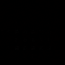

# CNN-TLSM
Asynchronous training of ResNet-18 and Time-aware LSTM

This repository contains full training code for a 3D ResNet18 CNN backbone in Keras for survival prediction on preprocessed, spatially registered volumetric MRI data, along with GradCAM/SHAP explainability tools. 
Our own implementation of the Time-aware LSTM model architecture (Baytas et. al., 2017) with vector-based attention and Cox proportional hazards loss (Deepsurv, Katzman et. al. 2018) are available in TLSTM-Dependencies.py The TimeLSTM and CoxPH model are implemented in PyTorch and can be integrated or trained separately as needed

“Data required for training is not provided due to privacy restrictions regarding ADNI data. Please update the paths in config.py accordingly.”

## Code Structure

**model.py**: Defines the 3D ResNet architecture with residual blocks

**TLSTM-Dependencies.py**: Contains the PyTorch TimeLSTM and attention module for longitudinal survival model

**data.py**: Data loading and preprocessing utilities for NIfTI files and CSV metadata

**loss.py**: Custom loss functions for survival ranking and Cox proportional hazards

**callbacks.py**: Custom Keras callbacks for validation and model saving

**explain.py**: Functions to generate SHAP and Grad-CAM explanations, including visualization and saving

**main.py**: Main script orchestrating training, evaluation, feature extraction, and explanations

**config.py**: Hyperparameters and file path configuration

## Configuration
All hyperparameters and paths are defined in config.py, including:

- Data paths (TRAIN_CSV, VAL_CSV, TEST_CSV)

- Model parameters (DROPOUT_RATE, TARGET_SHAPE)

- Training parameters (BATCH_SIZE, LEARNING_RATE, EPOCHS)

- SHAP explanation parameters (SHAP_BACKGROUND_SIZE, SHAP_NSAMPLES)

- Grad-CAM target layer (GRAD_CAM_LAYER)

Modify this file to suit your dataset and environment.

## Training and Evaluation

This script will:

- Load and preprocess MRI data from CSV lists of file paths

- Build the 3D ResNet model

- Train the model with ranking loss and Adam optimizer

- Use callbacks for early stopping, learning rate reduction, and model checkpointing based on validation performance

- Save the best model checkpoint

- Extract features from the trained model’s global average pooling layer

- Save extracted features for train/val/test splits
	
Within main.py, after training and evaluation:

- Generate **SHAP explanations** and **Grad-CAM heatmaps** for a selected sample from the training set  
- Overlay **Grad-CAM heatmaps** and **SHAP values** on MRI slices  

## Example Visualizations

### SHAP Explanation

### Grad-CAM Heatmaps

## Citation

If you found this code useful, please cite the following paper.

- Title: **Longitudinal Structural MRI-Based Deep Learning and Radiomics Features for Predicting Alzheimer's Disease Progression**
- authors:
  - family-names: "Aghajanian, Mohammadifard, Mohammadi, ....."
    given-names: "Sepehr, Fateme, Ida, ......"
    orcid: "https://orcid.org/0000-0001-6062-0138"
- doi: To be added....
